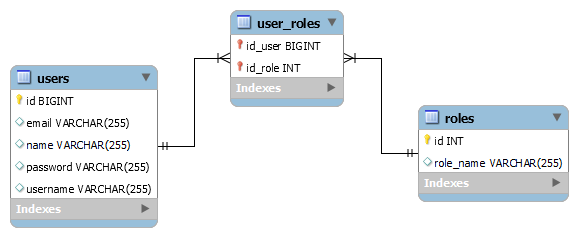

# Spring Security JWT

Proyecto backend para el Sistema Mascotas Perdidas

## Descripción

Es posible usar Spring v2.5.x o superiores.

## Inicio

### Dependencias

* Jjwt, Oauth2, Spring JPA, MySQL driver, Java 8 u 11.
* Sistema Operativo Independiente

### Instalación

* Clonar el repositorio
```
git clone https://github.com/Capdoo/spring-jwt-security
```

* Crear la Base de Datos usando MySQL
```
CREATE DATABASE security CHARACTER SET utf8 COLLATE utf8_general_ci;
```


### Editar las propiedades

* Es necesario modificar el archivo application.properties
* Se debe indicar el nombre de usuario y contraseña de la Base de Datos

```
spring.datasource.url=jdbc:mysql://<host>:<port>/mascotasBD
spring.datasource.username=<username>
spring.datasource.password=<password>
spring.datasource.driver-class-name=com.mysql.cj.jdbc.Driver
```

## Ejecución

Iniciar el proyecto a través de cualquier IDE.
```
Actualizar las dependencias (pom.xml)
Cambiar la configuración en propiedades
Hacer build
```


## Diagrama ER


## Authors

Contribuidores y enlaces

. [@Capdoo](https://github.com/Capdoo)


## License

This project is licensed under the terms of the MIT license.

## Acknowledgments

Spring Data e Hibernate
* [Spring Many To Many - Baeldung](https://www.baeldung.com/hibernate-many-to-many)
